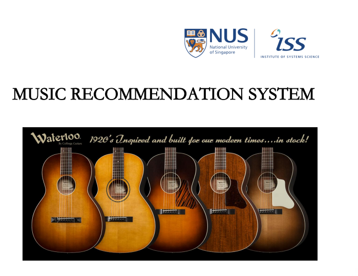
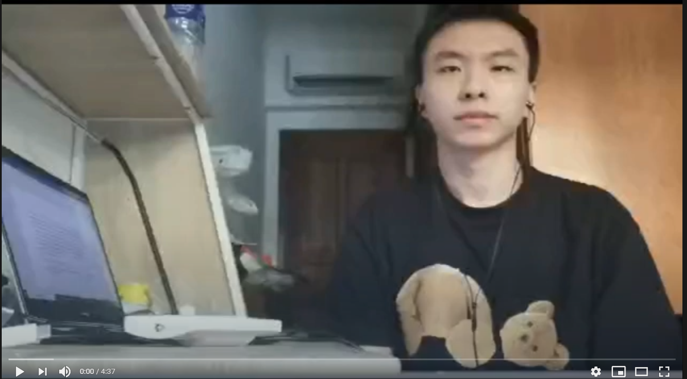

## SECTION 1 : PROJECT TITLE
## Video-Music Match System

---

## SECTION 2 : EXECUTIVE SUMMARY / PAPER ABSTRACT
Automatic video editing is receiving increasingly attention as the digital camera technology develops further and social media sites such as YouTube and TikTok become popular. Background music selection is one of the key elements to make the generated video attractive. In this work, we propose a system for background music recommendation based on semantic analysis and rule engine between video and music. 

In the field of short video, ML/DL technology also shows great potential. For example, the recommendation algorithm that tiktok is famous for, or the image processing technology in the video, the optimization of the face and background.

However, for the music recommendation part, AI technology has not been widely used. Imagine that when you make a video and plan to share it, the software will only recommend some music based on your age, gender, preference, or the current hottest music, and it will not be linked to your video content. The result of this is that algorithm output music is often not suitable with your video. If we have a algorithm to make a more suitable music recommendation system for this video, then we believe the produced video must be more attractive. 

In our project, we hope to solve the problem that the music recommended in short video production does not meet the video content. With our product,when the user inputs a video, our product can match the most suitable BGM for it and output the combined video. In this process, our algorithm will extract some frames from the video, analyze the brightness of each frame and do image classification, then use the rule engine to find the most matching music. We also want to use GA (genetic algorithms)  to improve our matching algorithm base on the user viewing time. The pipeline of our recommendation system is shown in Figure.\ref{flowgraph2}

In the future, in addition to the content of the video itself, we may combine users' own data, preferences, or popular music of the month and year to make a more reasonable detection.

---

## SECTION 3 : CREDITS / PROJECT CONTRIBUTION

| Official Full Name  | Student ID (MTech Applicable)  | Work Items (Who Did What) | Email (Optional) |
| :------------ |:---------------:| :-----| :-----|
| Zeyu Ma | A0186896B | FEdesign, BEdesign, Model building dicsussion| E0321134@nus.edu.sg |
| Zhang Jiuyun | A0215513R | GA design Rule engine Frame extraction| E0535603@u.nus.edu |
| Jiang Hao | A0215300A |Multi-label classificaiton model Rule Engine Frame extraction| haojiang@u.nus.edu |

---

## SECTION 4 : VIDEO OF SYSTEM MODELLING & USE CASE DEMO

---

## SECTION 5 : USER GUIDE

### Requirements

Install ffmpeg. For more detail , please go to https://ffmpeg.org/

Please, install the following packages
- numpy
- torchnet- 3.0.3
- flask - 1.1.1
- OpenCV - 4.4.0
- torchvision - 0.7.0

### Model Checkpoint

Download Coco_checkpoint from https://drive.google.com/file/d/1RPL93AtXB6tME5VIDLBXt-vF5herO5e-/view?usp=sharing ,
Put it in to project code root directory. 

### Guide
- run run.py in root directory.
- open browser, go to http://127.0.0.1:8987/index.
- Click choose file button, select a MP4 or AVI format file and upload it (we prepare "demo_video/demo_video.mp4" for you to test)
- Waiting for 1 - 5 mins, you can see progress in terminal output
- return and play a new a video in FE ,

---
## SECTION 6 : PROJECT REPORT / PAPER

`Refer to project report at Github Folder: ProjectReport`

**Recommended Sections for Project Report / Paper:**
- Executive Summary / Paper Abstract
- Sponsor Company Introduction (if applicable)
- Business Problem Background
- Market Research
- Project Objectives & Success Measurements
- Project Solution (To detail domain modelling & system design.)
- Project Implementation (To detail system development & testing approach.)
- Project Performance & Validation (To prove project objectives are met.)
- Project Conclusions: Findings & Recommendation
- Appendix of report: Project Proposal
- Appendix of report: Mapped System Functionalities against knowledge, techniques and skills of modular courses: MR, RS, CGS
- Appendix of report: Installation and User Guide
- Appendix of report: 1-2 pages individual project report per project member, including: Individual reflection of project journey: (1) personal contribution to group project (2) what learnt is most useful for you (3) how you can apply the knowledge and skills in other situations or your workplaces
- Appendix of report: List of Abbreviations (if applicable)
- Appendix of report: References (if applicable)

- market research
- problem in selecting BGM in short video 
- product plan
- business case 
- Automatically Recommend Music System 5
- Multilabel classification 
- Graph Convolutional Networks(GCN)
- Resnet 
- ensemble of GCN and resnet
- Rule engine 
- GA
- Population Chromosome
- Fitness Value 
- Stopping Criteria
- Parents Selection
- Crossover and Mutation 
- GA Training 
- FE-BE Design 
- APPENDICES 1:Project proposal
- APPENDICES 2:Survey For Expert Knowledge
- APPENDICES 3:Installation
- APPENDICES 4: User Guide
- APPENDICES 5:Mapped System Functionalities 
- APPENDICES 6:JIANG HAO Personal report
- APPENDICES 7:MA ZEYU Personal report 
- APPENDICES 8:ZHANG JIUYUN Personal Report

